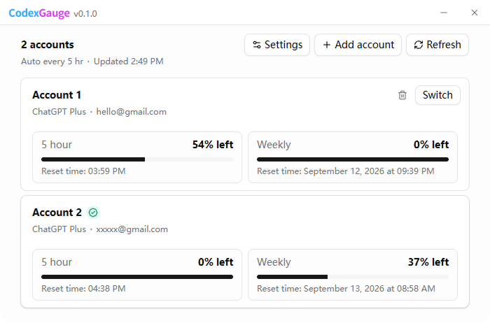

# CodexGauge

[English](README.md) | **简体中文**

<p align="center">
  
</p>

<p align="center">
  Windows 平台的本地 Codex 额度监控与多账号管理工具。
</p>

<p align="center">
  <a href="https://github.com/rfw/codex-gauge/releases/latest">下载 Windows 版</a>
</p>

CodexGauge 是一款本地优先的 Windows 桌面应用，用于查看 Codex 使用额度与重置时间，并手动管理多个由用户本人拥有和控制的 Codex 账号。

项目基于 Tauri 2、Rust、React、TypeScript、Vite、Bun、Tailwind CSS 和 shadcn/ui 构建。

> **独立项目声明：** CodexGauge 与 OpenAI 无隶属关系，未获得 OpenAI 的认可、认证、背书或赞助。

## 功能亮点

- 查看 Codex 5 小时额度和每周额度。
- 在 Codex 返回相关数据时显示剩余额度（Credits）。
- 按本地语言和时区显示额度重置时间。
- 在多个已管理账号中显示最早的有效“下次重置”。
- 查看限额重置（Banked resets）及其到期信息。
- 通过官方 Codex CLI 登录流程添加多个由用户本人拥有的账号。
- 手动切换当前账号。
- 修改本地账号名称。
- 删除非当前账号。
- 所有账号共用一个 `CODEX_HOME`，因此 Codex 的会话、历史记录、Memory 和配置保持共享。
- 使用 Windows DPAPI，并按当前 Windows 用户加密保存账号凭据备份。
- 检测 Codex `auth.json` 的变化，并同步更新当前账号的凭据备份。
- 切换账号前先验证目标账号凭据，验证失败时不会替换当前账号。
- 支持从 30 秒到 5 小时的自动额度刷新间隔。
- 网络不可用时保留最近一次成功获取的额度数据。
- 支持无代理、Windows/系统代理和自定义 HTTP/HTTPS 代理。
- 检查更新和下载更新时复用 CodexGauge 中配置的代理。
- 支持英语和简体中文，并可自动跟随系统语言。
- 支持系统、浅色和深色主题。
- 关闭主窗口后继续在 Windows 系统托盘中运行。
- 支持检查签名更新、显示下载进度，并通过 GitHub Releases 安装更新。
- 本地写入诊断日志，且不会有意记录身份验证 Token。

## 系统要求

### Windows

CodexGauge 当前主要面向 Windows。

### 官方 Codex CLI

必须已安装官方 OpenAI Codex CLI，并确保可以通过 `PATH` 访问。

可通过以下命令确认：

```powershell
codex --version
```

如果 CodexGauge 未检测到 Codex CLI，会阻止进入主界面，并提示用户先完成安装。

不要求安装 Codex Desktop 或 ChatGPT Desktop。

## 安装

从以下地址下载最新 Windows 安装程序：

https://github.com/rfw/codex-gauge/releases/latest

下载后正常安装并启动 CodexGauge 即可。

> 如果安装程序尚未使用 Authenticode 代码签名，Windows 可能显示 SmartScreen 或“未知发布者”警告。

## 额度数据

CodexGauge 通过官方本地 Codex app-server 协议读取额度：

```text
codex app-server --stdio
```

并请求：

```text
account/rateLimits/read
```

CodexGauge 根据额度窗口时长进行分类，而不是假设 primary / secondary 的固定顺序：

- `300` 分钟 → 5 小时额度
- `10080` 分钟 → 每周额度

CodexGauge 不会另外实现一套私有的额度 API 客户端。

### 重置时间显示

CodexGauge 会按用户本地时间显示额度重置时间，并在所有已管理账号中突出显示最早的有效“下次重置”。

如果某个账号的每周额度仍有剩余，则其 5 小时重置时间作为该账号的有效候选时间；如果每周额度已经耗尽，则改用每周额度的重置时间作为该账号的有效候选时间。

顶部会比较所有账号未来有效的候选时间，并显示最早的一项。

只有在 Codex 的额度响应中包含 Credits 信息时，CodexGauge 才显示剩余额度；如果返回的余额为 `0`，仍会正常显示 `0`。

## 账号切换机制

CodexGauge 使用一个共享的 Codex 主目录：

```text
%USERPROFILE%\.codex
```

或者使用 `CODEX_HOME` 指定的目录。

CodexGauge **不会**为每个账号创建一个独立、永久的 Codex Home。所有账号共享会话、历史记录、Memory、配置和其他本地状态，只在切换时替换当前使用的身份验证凭据。

切换账号前，CodexGauge 会先保存当前账号的最新凭据。保存的账号凭据备份会通过 Windows DPAPI，并按当前 Windows 用户进行加密。

在替换主 Codex 身份验证状态之前，CodexGauge 会先在隔离的临时 Codex 环境中验证目标账号。如果目标账号登录已过期、被撤销，或者无法完成验证，当前账号将保持不变。

出于安全考虑，当检测到 Codex 正在运行时，CodexGauge 会阻止账号切换。

CodexGauge 不会根据额度状态自动轮换账号。

## 代理设置

CodexGauge 支持三种代理模式。

### 无代理

CodexGauge 会从其启动的 Codex 进程中移除代理环境变量，并关闭这些进程对 Codex 系统代理机制的使用。

检查更新和下载更新时也会强制直连，不使用代理。

### 系统代理

CodexGauge 允许其启动的 Codex 进程和 Updater 使用 Windows/系统提供的代理行为。

### 自定义代理

CodexGauge 支持 HTTP 或 HTTPS 代理，例如：

```text
http://127.0.0.1:7897
```

或者：

```text
https://proxy.example.com:443
```

如果省略协议，CodexGauge 会按 HTTP 代理处理。

配置的自定义代理同样会用于检查更新以及从 GitHub Releases 下载更新文件。

CodexGauge 本身不提供代理/VPN 服务，不会修改 Windows 全局代理配置，也不会修改 `%USERPROFILE%\.codex\.env`。

## 自动刷新

自动刷新额度默认开启，默认间隔为 60 秒。

界面提供以下预设：

- 30 秒
- 60 秒
- 2 分钟
- 5 分钟
- 10 分钟
- 15 分钟
- 30 分钟
- 1 小时
- 3 小时
- 5 小时

启用后，CodexGauge 会按所选间隔自动刷新额度。

如果无法连接 ChatGPT，CodexGauge 会保留最近一次成功获取的额度数据，并暂停自动刷新，直到重试成功。

手动点击刷新后，会重新开始自动刷新计时。

## 语言

CodexGauge 当前提供：

- English
- 简体中文

默认语言选项会跟随 Windows 系统语言。

如果用户手动选择语言，该设置会保存在 CodexGauge 本地配置中，并在下次启动时恢复。

原生系统托盘菜单也会跟随应用当前语言。

## 主题

CodexGauge 支持：

- 跟随系统
- 浅色
- 深色

选择“跟随系统”时，CodexGauge 会跟随 Windows 的颜色模式偏好。

主题修改会立即生效，并保存在本地设置中。

应用启动时，Tauri 主窗口会在语言和主题初始化期间保持隐藏，等 React 首帧完成渲染后再显示，从而避免深色模式启动时短暂出现白屏。

## 系统托盘

点击窗口关闭按钮或使用 `Alt+F4` 时，CodexGauge 不会退出，而是继续在 Windows 系统托盘中运行。

第一次关闭主窗口时，CodexGauge 会先说明这一行为，再隐藏窗口。该提示只显示一次。

托盘支持：

- 左键单击恢复并聚焦 CodexGauge；
- `显示CodexGauge`；
- `退出`。

选择简体中文后，托盘菜单会同步显示中文。

只有选择“退出”才会真正关闭 CodexGauge。

普通最小化按钮仍会将 CodexGauge 最小化到 Windows 任务栏。

## 应用更新

CodexGauge 使用 Tauri Updater，通过 GitHub Releases 分发并安装经过签名的应用更新。

应用支持：

- 启动时自动检查更新；
- 从 `设置 → 关于` 手动检查更新；
- 在现有更新弹窗中显示下载进度；
- 安装可用的签名更新；
- 网络异常后重试；
- 稍后更新；
- 忽略某一个指定版本。

Updater 的网络请求会遵循 CodexGauge 当前配置的代理模式，包括更新检查和 GitHub Release 文件下载。

忽略某个版本只会影响自动更新提示；手动检查更新时仍然可以检测到该版本。

Updater 更新文件会经过加密签名验证。Updater 公钥嵌入在应用配置中，而签名私钥必须始终保密。

## 日志

CodexGauge 会在本地写入诊断日志，用于排查问题。

Windows 下，日志通常保存在应用本地日志目录：

```text
%LOCALAPPDATA%\com.codexgauge.desktop\logs\
```

详细的内部错误可以写入日志，同时界面只显示更简短、适合用户阅读的错误信息。

诊断日志只保存在本地，不会自动上传。

CodexGauge 不应有意记录身份验证 Token、Refresh Token 或完整的原始 `auth.json` 内容。

## 开发

安装依赖：

```powershell
bun install
```

运行 Web 前端：

```powershell
bun run dev
```

运行 Tauri 应用：

```powershell
bun tauri dev
```

构建前端生产版本：

```powershell
bun run build
```

Rust 检查：

```powershell
cd src-tauri
cargo check
cd ..
```

构建 Windows 应用及安装程序：

```powershell
bun tauri build
```

Tauri 构建产物位于：

```text
src-tauri\target\release\bundle\
```

## 安全与隐私

- 本地优先：CodexGauge 没有应用后端。
- 默认不包含遥测。
- 诊断日志仅保存在本地，不会自动上传。
- 账号凭据备份使用 Windows DPAPI，并按当前 Windows 用户加密。
- CodexGauge 不会通过本地 HTTP 服务暴露账号凭据。
- CodexGauge 不会实现基于额度状态的自动账号轮换。
- CodexGauge 不提供共享凭据池或账号共享功能。
- CodexGauge 不会有意在明文账号元数据中保存身份验证凭据。
- 安装更新前，会通过 Tauri Updater 的签名机制验证更新文件。

如果你发现了与凭据处理或身份验证有关的安全漏洞，请不要在公开 Issue 中发布包含敏感信息的复现数据。

## 项目范围

CodexGauge 面向由用户本人拥有和控制的账号，用于手动管理这些账号。

CodexGauge 不用于：

- 在不同用户之间共享或汇集凭据；
- 为规避额度限制而自动轮换账号；
- 提供共享账号或凭据池；
- 提供代理/VPN 服务；
- 冒充 OpenAI 官方产品。

## 许可证

MIT。详见 [LICENSE](LICENSE)。

## 商标声明

CodexGauge 是独立开源项目，与 OpenAI 无隶属关系，未获得 OpenAI 的认可、认证、背书或赞助。

OpenAI 及其相关产品名称、Logo 和商标均归其相应权利人所有。CodexGauge 的应用标识中未使用 OpenAI Logo 或品牌视觉资产。
