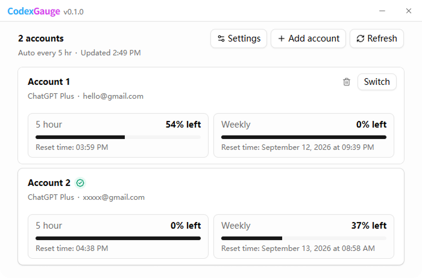

# CodexGauge

[English](README.md) | **简体中文**

<p style="text-align: center">
  
</p>

<p style="text-align: center">
  Windows 与 macOS 平台的本地 Codex 额度监控与多账号管理工具。
</p>

<p style="text-align: center">
  <a href="https://github.com/rfw/codex-gauge/releases/latest">下载最新版本</a>
</p>

CodexGauge 是一款本地优先的桌面应用，用于查看 Codex 使用额度和重置时间、接收额度重置提醒，并管理多个由用户本人拥有的 Codex 账号。

项目基于 Tauri 2、Rust、React、TypeScript、Vite、Bun、Tailwind CSS 和 shadcn/ui 构建。

> **独立项目声明：** CodexGauge 与 OpenAI 无隶属关系，未获得 OpenAI 的认可、认证、背书或赞助。

## 主要功能

- **额度监控** — 查看 Codex 5 小时额度、每周额度、重置时间，以及可用时的剩余 Credits。
- **多账号管理** — 在本地添加并管理多个 Codex 账号。
- **快速切换账号** — 手动切换当前 Codex 账号，无需为每个账号维护独立 Codex 环境。
- **重置提醒** — 到达下一次有效的 5 小时或每周额度重置时间后发送系统通知。
- **下次重置** — 自动汇总多个账号，显示最近一次有效重置时间。
- **Banked Resets** — 在 Codex 提供数据时显示可用次数及到期时间。
- **自动刷新** — 按设定间隔自动更新账号额度。
- **代理支持** — 支持无代理、系统代理和自定义 HTTP/HTTPS 代理。
- **主题** — 支持跟随系统、浅色和深色模式。
- **多语言** — 支持英语和简体中文，并可自动跟随系统语言。

## 支持平台

| 平台 | 架构 |
| --- | --- |
| Windows | x64 |
| macOS | Universal — Intel + Apple Silicon |

macOS Universal 版本使用同一个安装包，同时支持 Intel Mac 和 M1、M2、M3、M4 及后续 Apple Silicon Mac。

## 使用要求

需要安装官方 OpenAI Codex CLI，并确保 CodexGauge 可以找到它。

可通过以下命令检查：

```bash
codex --version
```

不要求安装 Codex Desktop 或 ChatGPT Desktop。

## 安装

从 GitHub Releases 下载最新版本：

https://github.com/rfw/codex-gauge/releases/latest

### Windows

下载 Windows 安装程序后正常安装即可。

如果安装程序尚未进行代码签名，Windows 可能显示 SmartScreen 或“未知发布者”提示。

### macOS

下载 Universal `.dmg` 即可，同一个版本同时支持 Intel 和 Apple Silicon Mac。

当前 macOS 版本使用 ad-hoc 签名，没有 Apple Developer ID 公证，因此首次启动时 macOS 可能阻止打开。此时进入：

**系统设置 → 隐私与安全性 → 仍要打开**

再次确认即可。该提示仅与当前没有使用 Apple Developer 证书分发有关。

## 多账号管理

CodexGauge 使用一个共享的 Codex Home，只在切换账号时替换当前身份验证凭据，因此 Codex 的会话、历史记录、Memory 和配置仍然保持共享。

账号凭据只保存在本地，并使用不同平台的系统能力进行保护：

- **Windows：** Windows DPAPI
- **macOS：** macOS Keychain

切换账号前会先验证目标账号。目标登录无效、过期或验证失败时，不会覆盖当前正常使用的账号。

CodexGauge 不会根据额度自动轮换账号。

## 额度与重置提醒

CodexGauge 通过官方本地 Codex app-server 协议读取额度，并显示可用的 5 小时和每周额度窗口。

重置时间按照用户本地时间显示。开启重置提醒后，到达下一次有效重置时间时，CodexGauge 会发送原生系统通知。

自动刷新间隔可在 30 秒到 5 小时之间配置。

## 语言

目前支持：

- English
- 简体中文

默认跟随系统语言。手动选择语言后会保存在本地，并在下次启动时自动恢复。

## 隐私与安全

- 无 CodexGauge 应用后端。
- 默认不包含遥测。
- 账号凭据只保存在当前设备。
- Windows 使用 DPAPI 保护账号凭据。
- macOS 使用 Keychain 保存账号凭据。
- 诊断日志仅保存在本地，不会自动上传。
- 不会有意将 Token 或完整 `auth.json` 内容写入日志。
- 不提供共享账号、共享凭据池或基于额度的自动账号轮换。

## 开发

安装依赖：

```bash
bun install
```

启动开发环境：

```bash
bun tauri dev
```

构建前端：

```bash
bun run build
```

构建桌面应用：

```bash
bun tauri build
```

在 macOS 构建 Universal 版本：

```bash
rustup target add aarch64-apple-darwin x86_64-apple-darwin
bun tauri build --target universal-apple-darwin
```

推送符合 `v*` 的 Release Tag 后，GitHub Actions 会自动构建 Windows 版本和 macOS Universal 版本。

## 项目范围

CodexGauge 面向由用户本人拥有和控制的账号，用于手动管理这些账号。

项目不用于在不同用户之间共享凭据、自动轮换账号规避额度限制、提供共享账号，或冒充 OpenAI 官方产品。

## 许可证

MIT。详见 [LICENSE](LICENSE)。

## 商标声明

CodexGauge 是独立开源项目，与 OpenAI 无隶属关系，未获得 OpenAI 的认可、认证、背书或赞助。

OpenAI 及其相关产品名称、Logo 和商标均归其相应权利人所有。
